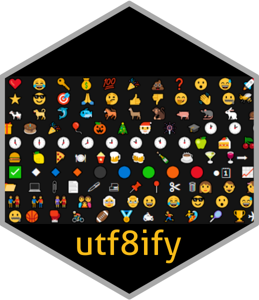

# utf8ify </a>

With {utf8ify} you can easily...

1️⃣ 𝗳𝗼𝗿𝗺𝗮𝘁 𝘁𝗲𝘅𝘁 
2️⃣ 𝐟𝐨𝐫𝐦𝐚𝐭 𝐭𝐞𝐱𝐭
3️⃣ 𝘧𝘰𝘳𝘮𝘢𝘵 𝘵𝘦𝘹𝘵
4️⃣ 𝒇𝒐𝒓𝒎𝒂𝒕 𝒕𝒆𝒙𝒕
5️⃣ 𝓯𝓸𝓻𝓶𝓪𝓽 𝓽𝓮𝔁𝓽
6️⃣ 𝖋𝖔𝖗𝖒𝖆𝖙 𝖙𝖊𝖝𝖙
7️⃣ ⓕⓞⓡⓜⓐⓣ ⓣⓔⓧⓣ
8️⃣ 𝚏𝚘𝚛𝚖𝚊𝚝 𝚝𝚎𝚡𝚝 𝚒𝚗 𝙻𝚒𝚗𝚔𝚎𝚍𝙸𝚗!

... using UTF8 characters!
😎 🚀

```r
library(utf8ify)
text <- " format text "
cat(paste0(
  utf8_number_box(1), utf8_text_bold(text),
  utf8_number_box(2), utf8_text_bold2(text),
  utf8_number_box(3), utf8_text_italic(text),
  utf8_number_box(4), utf8_text_bolditalic(text),
  utf8_number_box(5), utf8_text_cursive(text),
  utf8_number_box(6), utf8_text_gothic(text),
  utf8_number_box(7), utf8_text_circle(text),
  utf8_number_box(8), utf8_text_monospace(text),
  "\n... using UTF8 characters!\n",
  utf8_collection()$fav$sunglasses,
  utf8_collection()$fav$rocket
))
```
Or use `utf8_collection()` to access one of the preselected UTF8 characters (organised as lists)... 👍😀

fav:
➡ ⬅ 🍺 💡 ✔️ 👏 ☕ ❌ 📧 👀 🔥 👉 👈 😀 ❤️ 😂 🔑 💰 💯 🎉 💩 ❓ 😮 😅 🚀 💬 ⭐ 😎 🎯 🙏 🤔 👍 👎 🤭 👋 🤐
animal:
🐝 🐂 🐈 🐄 🐕 🐬 🐟 🐎 🦙 🐒 🐖 🐀 🐇 🐌 🐅
celebrate:
🎁 🎂 🎉 🎈 🎃 🎄 🎅 🎆 🎓
clock:
🕐 🕑 🕒 🕓 🕔 🕕 🕖 🕗 🕘 🕙 🕚 🕛
eat:
🍏 🍰 🍒 🍪 🍟 🍔 🍋 🍕 🍽 🍿
drink:
🍺 🍻 🍾 ☕ 🍸 🍷
list:
➡ ○ ✔️ ✅ ◆ 🔹 🔸 ⚫ 🔵 🟢 🟠 🔴 ●
office:
🗓 📈 📉 🖥 📂 💻 📎 📄 🖊 🖨 📌 📍 ✂ 🗑
person:
👩 👨 👧 👦 👫 👬 👭 👪 👵 👴
smiley:
😀 😂 😎 😮 😅 🤔 🤭 🤐
sport:
🏀 🥊 🚴 🏈 🏅 🏍 🏃 🏄 🎾 🏆
travel:
✈ 🚲 🚗 🚁 🧳 🚇 🚀 ⛵ 🛴 🚢 🚜 🚆


```r
u <- utf8_collection()
cat(u$fav$thumbs_up, u$smiley$happy)
for (i in seq(1, length(u))) {
  cat(paste0(
    "\n", names(u[i]), ":\n",
    paste(unlist(u[i]), collapse = " ")
  ))
}
```